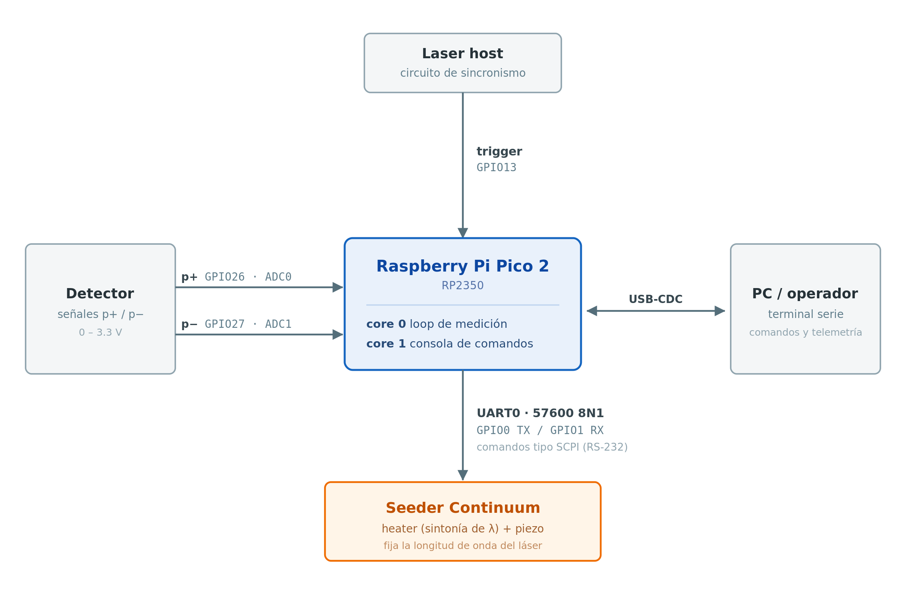

# hsrl-control-rpico2

Firmware de control de longitud de onda del *seeder* de un lidar HSRL, sobre
Raspberry Pi Pico 2 (RP2350).

Reemplaza al sistema anterior (`wvcnt_lec.cpp`), que corría en una PC y medía las
señales del detector a través de un osciloscopio Tektronix conectado por USB-VISA.
La Pico digitaliza las señales directamente con su ADC interno, sincronizado
con el trigger del generador de ondas, y se comunica al seeder por UART. El operador
controla todo desde una consola serie sobre USB.

---

## 1. Contexto

Un **HSRL** (High Spectral Resolution Lidar) separa el retorno atmosférico en su
componente molecular (Rayleigh, ensanchada por temperatura) y su componente de
aerosoles (Mie, espectralmente angosta). Esa separación se hace con un filtro de
absorción muy angosto, y sólo funciona si la longitud de onda del láser está
sintonizada respecto la línea de absorción del filtro.

En este sistema la longitud de onda la fija un **seeder Continuum**, cuyo
oscilador se sintoniza con la temperatura de un *heater* (y, en principio,
con un piezo). El firmware:

1. Mide dos señales del detector, **p+** y **p-**, tomadas a ambos lados de la
   línea de absorción;
2. Calcula el cociente `prt = p+ / p-`, que es **monótono con la longitud de
   onda** cerca del punto de trabajo;
3. Corrige el setpoint de temperatura del heater para mantener ese cociente
   dentro de una banda alrededor de una referencia.

La calibración inicial (modo `a`) aprovecha que **cada canal absorbe en una
longitud de onda distinta**: al barrer en temperatura, p+ y p- pasan por su mínimo en temperaturas diferentes, y el punto de operación buscado es la temperatura media de ambos.

---

## 2. Arquitectura



### Módulos

| Archivo | Rol |
|---|---|
| `hsrl-control.c` | `main()`, loop de medición (core0), parser de comandos (core1), modo automático |
| `adc_capture.c/.h` | Captura de picos por ADC sincronizada al trigger, promediado |
| `control.c/.h` | Máquina de estados de los modos y cálculo de los deltas del setpoint |
| `seeder_comm.c/.h` | Protocolo tipo SCPI con el seeder por UART |
| `config.h` | Pines, parámetros por defecto y límites — **acá se toca la configuración** |


## 3. Modos de operación

| Modo | Comando | Qué hace |
|---|---|---|
| Stop | `s` | Detenido. |
| Forward | `f` | Sube el heater en pasos gruesos (λ crece) |
| Backward | `b` | Baja el heater en pasos gruesos (λ decrece) |
| Lock | `g` | Sintonización automática sobre `prt` |
| Auto | `a` | Barrido de calibración + sintonía automática |
| End | `e` | Termina el programa |

### Lock (`g`)

Toma como referencia `prt_ref` el cociente de **dos ciclos atrás**
(criterio heredado de `wvcnt_lec.cpp`) y después aplica una banda muerta
multiplicativa con coeficiente `coe`:

```
prt > prt_ref · coe   →  d_heater = −paso_fino
prt < prt_ref / coe   →  d_heater = +paso_fino
en el medio           →  d_heater = 0
```

Es un control tipo *bang-bang* con zona muerta. La banda evita estar corrigiendo permanentemente sobre el
ruido de medición.

### Auto (`a`)

1. Va hacia el extremo inferior del rango (`heater_min`).
2. Hace `n_barridos` recorridos de ida y vuelta hasta `heater_max`, con paso
   grueso, midiendo en cada punto.
3. Registra el mínimo global de p+ y el de p-, con la temperatura de cada uno.
4. Calcula el punto de operación `t_op = (t_min_p+ + t_min_p-) / 2` va ahí y toma `prt` como referencia.
5. Cambia solo a modo **Lock**.


### Protección de rango

Si el setpoint se sale de `[heater_min, heater_max]`, el control fuerza la
dirección opuesta y suelta el lock de la sintonización.

---

## 4. Consola de comandos

Se conecta cualquier terminal serie al puerto CDC del Pico (`115200` es
irrelevante en USB-CDC; cualquier configuración funciona).

### Comandos de un carácter (no requieren Enter)

| Cmd | Acción |
|---|---|
| `s` `f` `b` `g` `a` `e` | Cambio de modo (ver arriba) |
| `?` | Muestra los parámetros que tiene cargados el Pico |
| `!` | Consulta al seeder: temperatura, piezo y flags de *second mode* |
| `d` | Diagnóstico: estado del lock + vaciado de la cola de errores |
| `w` | Escribe los setpoints al seeder ahora y verifica que los haya tomado |
| `u` | Desbloquea escrituras en el seeder (`CENable`) |
| `l` | Vuelve a bloquearlas (`CDISable`) |

### Comandos de parámetro (letra + valor + Enter)

| Cmd | Parámetro | Ejemplo | Default |
|---|---|---|---|
| `P` | Piezo, voltaje | `P2.500` | `2.0` |
| `V` | Piezo, paso | `V0.010` | `0.0` |
| `T` | Heater, setpoint | `T62.140` | `62.14` |
| `N` | Heater, mínimo | `N62.500` | `62.5` |
| `X` | Heater, máximo | `X63.100` | `63.1` |
| `R` | Heater, paso grueso | `R0.069923` | `0.069923` |
| `M` | Heater, paso medio | `M0.017750` | `0.01775` |
| `I` | Heater, paso fino | `I0.004438` | `0.0044375` |
| `A` | Picos a promediar (n) | `A5` | `1` (máx. 100) |
| `E` | Espera de estabilización, s | `E10` | `10` (máx. 600) |
| `S` | Barridos del modo auto | `S3` | `1` (máx. 20) |

> El piezo está fijo en esta versión (`piezo_paso = 0`): toda la sintonización se
> hace por temperatura.

---

## 5. Detalles de medición

### Captura de picos

`adc_capturar_pico()` espera el flanco de subida del trigger, arranca el ADC en
*free-running* con FIFO (~500 kSPS) y se queda con el **máximo** leído mientras
el trigger está alto.

Los dos canales se muestrean **intercalados**: un pulso de trigger para p+ y el
siguiente para p-.

### Espera de estabilización

Debido a la inercia termica del heater de cavidad del laser, el setpoint se manda al final de un ciclo de medicion y luego se espera un tiempo determinado, definido por el comando E, para que el seeder realice el proximo ciclo.

### Second mode

Al cierre de cada ciclo se consulta `:syst:smod:flag?`. El bit 0 en 1 indica que
el seeder salió de single mode, y por lo tanto **la medición de ese ciclo no es
confiable**. El firmware lo avisa por consola pero no actúa sobre él.

---

## 6. Comunicación con el seeder

Protocolo tipo SCPI, líneas terminadas en `\r\n`, UART0 a 57600 8N1 sin control
de flujo.

| Comando | Uso |
|---|---|
| `:syst:pass:cen "NP"` | Desbloquear comandos protegidos |
| `:syst:pass:cdis "NP"` | Volver a bloquear |
| `:syst:pass:cen:stat?` | Estado del bloqueo |
| `:syst:tcon2:spo` / `?` | Escribir / leer el **setpoint** del heater |
| `:syst:tmon2:temp?` | Leer la temperatura **medida** |
| `:syst:pdr:volt` / `?` | Escribir / leer el piezo |
| `:syst:smod:flag?` | Flags de second mode |
| `:syst:err?` | Cola de errores (FIFO, hasta 10) |

### Desactivación de modo protegido

El seeder arranca siempre con los comandos protegidos **bloqueados**: sin
desbloquear, las escrituras de temperatura y piezo se ignoran. El
firmware manda el password hasta `UNLOCK_MAX_INTENTOS` veces con
`UNLOCK_REINTENTO_MS` de espera, porque el seeder puede estar todavía
inicializándose cuando el Pico ya arrancó.

### Verificación de escrituras

 `d` muestra el estado del seeder y vacía la cola de errores.
Códigos útiles: 
- `-203` command protected
- `-102` syntax error 
- `-121` invalid character in number
- `-222` data out of range

---

## 7. Compilación y flasheo

**Requisitos:** Pico SDK 2.3.0, toolchain ARM 15_2_Rel1, CMake ≥ 3.13, Ninja.
La forma más simple es la extensión *Raspberry Pi Pico* de VS Code, que instala
todo bajo `~/.pico-sdk` y ya viene configurada en `.vscode/`.

Placa objetivo: `PICO_BOARD=pico2` (RP2350). `stdio` sale por **USB**, no por UART.

Por línea de comandos:

```bash
mkdir build && cd build
cmake -G Ninja ..
ninja
```


---

## 8. Conexionado

| Señal | GPIO | Notas |
|---|---|---|
| Trigger | 13 | Entrada digital con pull-down |
| p+ | 26 | ADC0 |
| p- | 27 | ADC1 |
| Seeder TX | 0 | UART0 TX |
| Seeder RX | 1 | UART0 RX |

**El ADC del RP2350 admite 0–3.3 V.** Las señales del detector tienen que estar
acondicionadas a ese rango y referenciadas a la masa del Pico. La conexión al
seeder es RS-232 y necesita conversor de niveles TTL-RS232.

---


